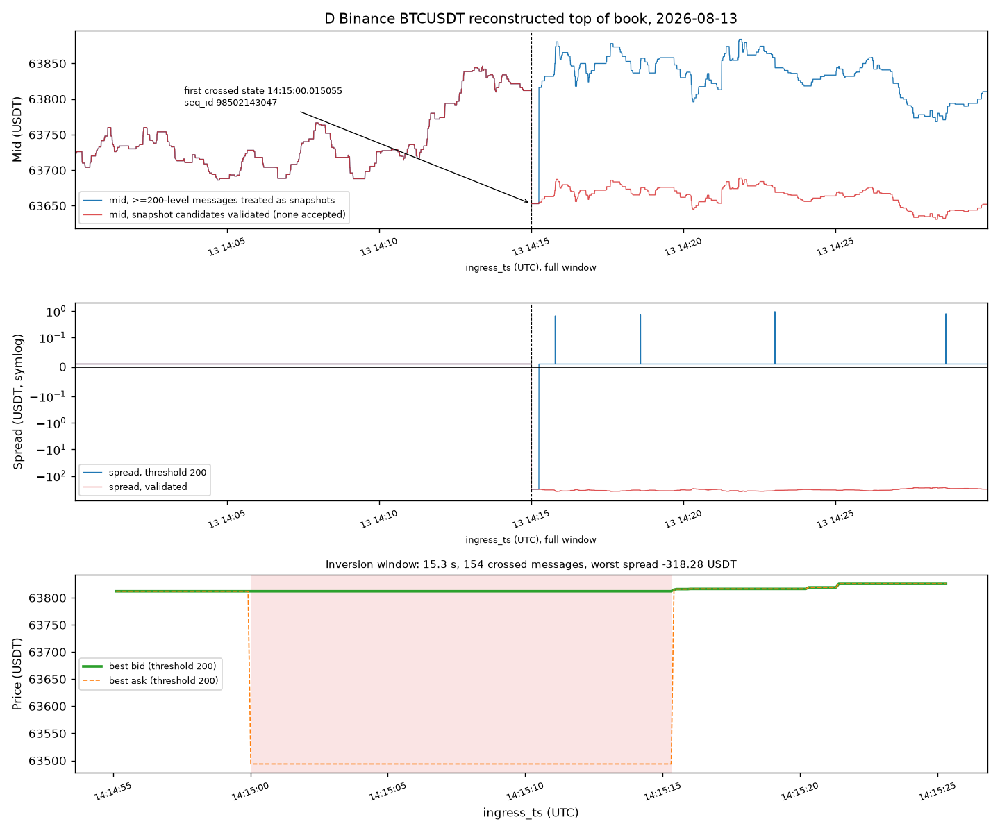
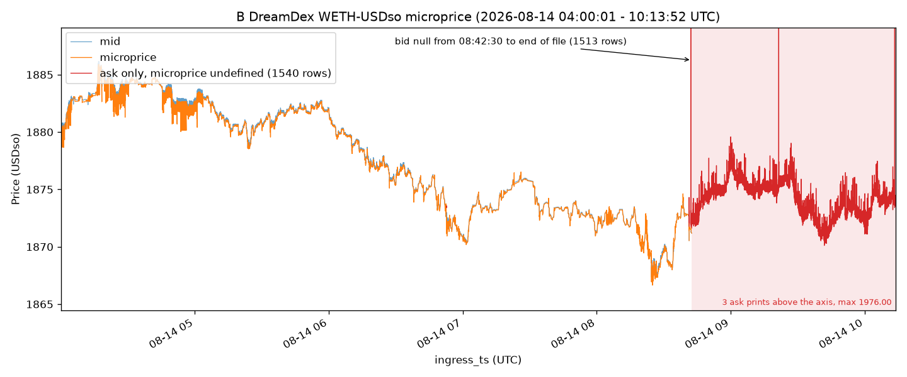

# Market Data Quality — Findings

Candidate deliverable for the [LO:TECH take-home](https://gist.github.com/jembishop/6e2aa508cd8c2a19c22515bacf2e86fc). Python + Polars; every claim comes from [`src/lotech_dq/`](src/lotech_dq) and [`scripts/`](scripts), with the numbers in [`outputs/tables/`](outputs/tables).

**Thesis.** Capture *latency* is healthy: median ingress lag is tens of milliseconds, Gate.io volume ties to the public candle exactly, Binance ETH is one tick wide 97.5% of the time. The normaliser contract is not. Clocks, symbol grammar, uniqueness and flags differ by venue, and the six defects below would mislead a client today.

**Classes.** `pipeline` = we introduced it; `market` = real venue behaviour that only looks like a defect; `unclear` = the file cannot settle it. Profiler alerts that turn out to be artefacts of how the check was posed get no class and are disposed of in section 9. **Units:** quote currency throughout — HKD (A), USD (C), USDT (D, F, H), USDso (B). USDT is treated as ≈ USD and never written `$`; durations are SI seconds.

| Would mislead a client | File | Class |
|---|---|---|
| Every `trade_id` emitted twice, so `sum(qty)` is exactly 2× true volume | G Bitfinex | pipeline |
| Session 100% `side=Buy`; 15.65% of trades missing venue time, and those are 38.15% of volume | A HKEX trades | pipeline |
| `snapshot` never set; one internally crossed message inverts the replayed book | D Binance L2 | pipeline |
| Filename says 20 symbols, file has 18, none with the `S\|` prefix; 1,030 crossed NBBO rows | C NASDAQ | pipeline |
| Bid vanishes for the last 1.5 h; microprice undefined on 22% of rows | B DreamDex | unclear, leaning pipeline |
| Both venue clocks absent from the schema, so no null-rate alert can fire | F Binance ETH | pipeline |

H is the control: the same pipeline can emit a tape that reconciles exactly with its venue.

## How this was done

The brief lists nine objects lettered A–D and F–H; there is no E. [`00_download.py`](scripts/00_download.py) fetches them and checks row counts ([`data/MANIFEST.md`](data/MANIFEST.md)). [`01_profile_all.py`](scripts/01_profile_all.py) runs a shared battery — absent columns, null rates, dtypes, monotonicity global *and* partitioned, gaps, duplicate keys, crossed/locked TOB, clock skew ([`checks.py`](src/lotech_dq/checks.py), [`clocks.py`](src/lotech_dq/clocks.py)) — into [`profile_summary.json`](outputs/tables/profile_summary.json), [`profile_findings.json`](outputs/tables/profile_findings.json), [`schemas.json`](outputs/tables/schemas.json) and [`clocks_matrix.json`](outputs/tables/clocks_matrix.json). Runners `02`–`08` do the per-file deep dives and the brief's three explicit tasks, writing the artefacts each section cites; [`09_exhibits.py`](scripts/09_exhibits.py) collects sample rows and ruled-out alternatives into [`exhibits.json`](outputs/tables/exhibits.json). The two `.parquet` series land in `outputs/tables/` but the repository's `*.parquet` rule keeps them out of git — clone and run to inspect them. Reproduce: [README.md](README.md).

**A generic profiler is necessary and not sufficient.** It called C's 461,372 backward `ingress_ts` steps high-severity pipeline (mostly 18 symbols multiplexed into one file) and A's 5,333 s skew tail "expected capture delay" (one stale quote re-published twelve times). And a check can be written so that it cannot fail: a monotonicity check that sorts on the column it then differences returns zero for any input, which is how a file with 12,514 violations came to look clean.

---

## 1. Capture latency is not the problem

Median ingress minus venue clock: **A** 33 ms (0 negatives on 109,544 TOB rows), **C** 88 ms with p99 286 ms (0 negatives on 3,752,799), **D** 0.5 ms against `publish_ts`, **H** 1.8 ms. No file shows a negative capture latency.

One exception, and it is idempotency not latency: A re-publishes stale quote *states* with a fresh `ingress_ts` (section 3.3), which is why A's TOB shows 41 backward `ingress_ts` steps in stored order, worst −5,332 s. Everything else interesting is downstream of capture.

---

## 2. G — every trade is in the file twice

**Window** 2026-05-23 12:00:00.913–12:09:50.190 UTC. **642 rows, 321 distinct `trade_id`**, `BTC-USD:SPOT` ([`07_analyse_G_bitfinex.py`](scripts/07_analyse_G_bitfinex.py) → [`G_bitfinex.json`](outputs/tables/G_bitfinex.json)). The smallest file, and the one a profiler is most likely to call clean.

Every `trade_id` appears exactly twice: 321 groups, all size 2, identical on price, qty, side and `transaction_ts`, differing on `publish_ts` and `ingress_ts` in all 321. Opposite-side pairs: **0**. Exhibit, `trade_id=1922482898`: both copies 74,831 / 0.0001 / Sell at venue time 12:00:00.913, published 12:00:00.914 and 12:00:00.963.

**Ruled out.** A signed-amount convention (0 negative and 0 zero qty); a maker/taker double-print (sides match in all 321 groups); an append of an adjacent window (every id is doubled, not a suffix).

**Hypothesis.** Bitfinex WS emits `te` (executed) then `tu` (updated) for one trade and the normaliser kept both. Pair separation supports it, being characteristic rather than random: median 49.0 ms on `publish_ts`, range 15–104. The mechanism stays a hypothesis; the duplication does not.

**Classification: pipeline, high confidence** on the duplication. A client summing `qty` reports **10.89697542 BTC** against a true **5.44848771 BTC** — exactly 2×. VWAP survives, since the copies are economically identical; trade count, last trade and inter-trade timing do not (338 of 641 gaps are exactly zero raw, 17 after dedupe). Deduping on `(instrument, trade_id)` is a shipped check and fires here with 321 groups.

---

## 3. A — HKEX 2800: side, clocks, and one stale-quote mechanism

**Window** TOB 2026-08-13 01:00:00.083–08:08:12.709 UTC; trades from 01:20 in venue time, earliest capture 01:07:20. **109,544 TOB + 9,666 trades**, `S|2800-HKD:SPOT` ([`02_analyse_A_hkex.py`](scripts/02_analyse_A_hkex.py) → [`A_hkex.json`](outputs/tables/A_hkex.json)). The session calendar in UTC — auction to 01:30, continuous, lunch 04:00–05:00, closing auction from 08:00 — is **market**. The defects are not.

### 3.1 Every trade is `Buy`, and side is recoverable

9,666 of 9,666 rows are `side=Buy`, and `other_data` is 100% null, so no residual venue flag survives. Side is still reconstructable from the book: of the 8,153 trades that join to the prevailing TOB, **7,780 (95.4%) print exactly at bid or ask**, and the Lee-Ready quote rule recovers **Buy 3,932 / Sell 3,850**, 371 unclassified — 50.53% buy among the classified. That near-even split is the best available evidence that the label is hard-coded rather than observed, and it gives the client a remediation path. **Classification: pipeline.** Any signed-volume or buy-versus-sell analytic on 2800 is fiction; the quote rule is inference, not venue truth.

### 3.2 Venue time missing on 1,513 trades — 15.65% of rows, 38.15% of volume

`transaction_ts` is null on 1,513 trades; `publish_ts` is present on every one. The row share understates the damage by over 2×, and the cohort is not a random sample:

| | null `transaction_ts` | has `transaction_ts` |
|---|---:|---:|
| rows | 1,513 (15.65%) | 8,153 (84.35%) |
| share of traded volume | **38.15%** | 61.85% |
| median size | 50,000 | 15,000 (**3.33×**) |
| price range, standard deviation | 24.00–26.10, 0.0812 | 25.78–26.02, 0.0376 |
| odd lots (not a multiple of the 500-share board lot) | **77 (5.09%)** | **0** |
| trade-through rate vs prevailing quote | **4.03%** | 0.037% |

**Ruled out.** A session-boundary artefact — 1,512 of 1,513 are in continuous trading by `publish_ts`, none at lunch. A random field dropout — 5.09% odd lots against exactly 0%, and a price range reaching the crossed-quote prices 24.00 and 26.10, are not random.

**Not ruled out, and it changes the fix.** These look like off-board, negotiated or special-lot prints routed through a path that never carried a venue match time, rather than a clock dropped off the main tape. One is a mapping fix; the other needs a trade-condition field the file lacks. **Classification: pipeline** either way, because the delivered data cannot separate them, and venue-time joins silently drop 38% of traded volume.

### 3.3 One mechanism produces both the crossed book and the 5,333 s skew tail

71 crossed rows (0.065% of 109,541 two-sided rows) and 112 locked (0.10%). The session split is decisive: **all 112 locked rows are in auction windows** (38 before 01:30, 74 from 08:00) and **none in continuous trading**, while **all 71 crossed rows are in continuous trading**. A locked book at an auction crossing is expected; a crossed book in continuous trading on a single-venue order book is not.

The 71 crossed rows are only **30 distinct quote states**, and **39 are re-emissions arriving over 60 s after their venue timestamp**. File-wide, 80 states are emitted more than once, producing 117 extra rows, 54 of them over 60 s late. The mechanism: a stale quote state is re-published every 5.8–9.2 minutes (345.7–554.0 s) with a fresh capture time.

| venue `transaction_ts` | book | emissions | last ingress | max lag |
|---|---|---:|---|---:|
| 03:36:36.099430 | bid 26.10 / ask 24.00 | 13 | 05:05:29.463 | **5,333.32 s** |
| 06:35:54.022180 | bid 25.94 / ask 25.86 | 11 | 07:50:11.390 | **4,457.33 s** |

The first cluster starts re-emitting at **03:44:31, sixteen minutes before lunch**, and is still going at 05:05; the second sits entirely in the afternoon session with no lunch near it. The 55 rows with skew above 60 s carry **19 distinct venue timestamps**, not one — 03:36:36 is merely the largest, at 12 rows. Lunch explains the size of the worst skew, not the behaviour: this is a session-wide re-publication defect.

**Distributions, not head rows.** Crossed ask price: 25.92 ×18, 25.86 ×17, 24.00 ×13, 25.00 ×10, then five prices with 5 rows or fewer — nine prices over 24.00–25.96. Ask size: 5 ×24, 4 ×19, 1 ×15, 2 ×7, 100 ×4, and single rows at 37 and **322**, so sizes of 1–2 cover only 22 of 71. Bid range 25.60–26.10. Inversion median 0.18 HKD, max 2.10, but 8 rows are exactly one 0.02 increment and 30 of 71 are within 0.10 — bimodal, mostly flicker-scale plus the 13 re-emissions of the 26.10 / 24.00 state.

**Classification: pipeline** for the re-emission, of which the crossed book is the visible symptom. **Locked: market.**

**Gaps.** Five gaps exceed 300 s on TOB `transaction_ts`, and all five are the session: 01:20:03.782 → 01:30:00.003 (596.22 s, auction into continuous), then 03:59:59.495 → 04:05:00.007 (300.51 s), 04:05:00.007 → 04:30:01.001 (1,500.99 s), 04:37:18.787 → 04:42:45.583 (326.80 s) and 04:42:45.583 → 04:59:00.000 (974.42 s), all lunch. **Market.** Median inter-quote gap 0.00061 s, p99 3.42 s.

### 3.4 Trades versus the book

Asof-joining the 8,153 trades carrying venue time to the prevailing TOB: **8,153 matched, 0 unmatched, 8,151 inside the spread, 3 strict trade-throughs (0.037%)** — 2 (0.025%) once the single crossed prevailing quote is handled rather than scored against an unsatisfiable test. Two are genuine: `trade_id=1018` prints 25.90 against a clean 25.92 / 25.94 and is a **15,000-share** print at the **46th percentile** of A's sizes, not a small one; `1070` prints 25.94 against a clean 25.90 / 25.92. Only `9555` sits beside a crossed quote, printing 25.86 *at the ask* of the crossed 25.90 / 25.86, so it is manufactured by 3.3's defect.

**Scope.** That 0.037% describes only the 84% carrying venue time; joining the excluded 1,513 on `publish_ts` gives **4.03%**, 110× the rate. "The tape is not randomly corrupted" holds for the joinable population and is unproven for the rest. The join is possible at all because `publish_ts` equals `transaction_ts` wherever both exist, so it is a usable substitute key.

---

## 4. D — the snapshot flag is dead, and one message inverts the book

**Window** 2026-08-13 14:00:00.014628–14:29:59.915000 UTC (29.998 min). **17,994 incremental L2 messages**, `BTC-USDT:SPOT`. Explicit task: replay snapshot plus deltas ([`05_analyse_D_binance_l2.py`](scripts/05_analyse_D_binance_l2.py), [`book.py`](src/lotech_dq/book.py) → [`D_binance_l2.json`](outputs/tables/D_binance_l2.json)).

`snapshot` is **false on all 17,994 rows** — 0 true, 0 null, dtype Boolean, so this is a mapping bug and not a missing column. `transaction_ts` is 100% null. Binance depth is snapshot plus `depthUpdate`, so a flag that is never true leaves the replay with no synchronisation point. **Classification of the flag: pipeline.**

### The state-free proof

`seq_id 98502143047` (index 8997, ingress 14:15:00.015055, 23 levels) is the **only message of 17,994 whose own payload puts its best bid above its own best ask**: 63,810.79 against 63,493.72, local spread −317.07 USDT. That comparison uses no replay state, so it cannot be a reconstruction artefact. It carries six ask levels priced 63,493.72–63,589.75; five of those prices appear **nowhere else in the file on either side**, and the sixth, 63,589.75, appears four other times and always as a **bid**. Messages 8994–8996 and 8998–9001 all quote 63,812.00 / 63,812.01, so the phantom is the **ask block**, not a stale bid, and 63,812.00 is the live touch. Every replay policy tested first crosses at this message. **Classification: pipeline, high confidence** — a corrupt price block in the delivered data, which needs no hedge about replay artefacts.

### The heuristic is provably wrong, and the deletes are the real story

With the flag unusable, one plausible policy treats any message of ≥ 200 combined levels as a snapshot; levels per message are heavy-tailed (median 14, max 1,207, 460 rows at or above 200), so a size test looks reasonable. It is falsifiable and false: **all 460 of those messages contain `qty == 0` deletes, 75,568 delete entries in total.** A snapshot cannot carry deletes, so none of them is one, and the default policy accepts none of the 460.

The file carries **207,901 deletes**, the one invariant number here. The share landing on a level never delivered is purely a function of policy: **20.1% with no heuristic, 61.6% at threshold 200, 94.9% at threshold 20**. None is a floating-point near-miss (0 had a book price within 1e-6), so those levels genuinely were never delivered — on any policy, the cleanest statement that this stream is unreplayable as delivered. The crossed-state count moves the same way, so neither should be quoted bare:

| snapshot policy | snapshots taken | crossed states | deletes missed |
|---|---:|---:|---:|
| none | 0 | 8,997 (50.0%) | 41,796 (20.1%) |
| threshold 20 | 6,385 | 2 (0.01%) | 197,385 (94.9%) |
| threshold 200 | 460 | 154 (0.86%) | 128,105 (61.6%) |
| validated (460 candidates, 0 accepted) | 0 | 8,997 (50.0%) | 41,796 (20.1%) |

Under threshold 200 the 154 crossed states are **one contiguous episode**, 14:15:00.015055 → 14:15:15.315142 UTC (15.300087 s), worst spread **−318.28 USDT**, and it ends only because a 250-level message trips the heuristic and clears the book, not because the market un-crossed. Under the validated policy the same episode runs 8,997 messages to end of file, worst −390.34 USDT. The inversion is in the data; only its duration is a function of the threshold, and no policy is right without a truthful flag or an independent REST snapshot.

Outside the episode the reconstruction is sound: uncrossed mid runs 63,686.005–63,884.065 USDT under threshold 200 (63,686.005–63,846.165 under the validated policy, which has no uncrossed rows after 14:15), median spread 0.01 USDT either way. The reconstructor is not randomly broken; it is unrecoverable once state diverges.

The reconstruction is inspectable, not merely plotted: `D_top_of_book_series.parquet` and `D_top_of_book_series_threshold200.parquet` carry per-message best bid/ask, sizes, mid, spread and a crossed flag for all 17,994 messages, and [`D_final_book.csv`](outputs/tables/D_final_book.csv) dumps the 3,515 final levels.

---

## 5. C — eighteen names, wrong grammar, and a one-second cross burst

**Rows** 3,752,799. **18 instruments, not 20.** Window 2026-08-13 14:00:00.003–15:59:59.999 UTC by capture time, i.e. 10:00–12:00 ET — mid-session, not the open ([`04_analyse_C_nasdaq.py`](scripts/04_analyse_C_nasdaq.py) → [`C_nasdaq.json`](outputs/tables/C_nasdaq.json), [`C_nasdaq_per_symbol.csv`](outputs/tables/C_nasdaq_per_symbol.csv)).

### Contract violations and a missing manifest

The brief's equity grammar is `S|2800-HKD:SPOT`. Every C symbol is `AAPL-USD:SPOT`, with **no `S|` prefix** and no venue qualifier, so the file does not say whether it is one venue or a composite. The filename says 20 symbols; the brief states no count, so the filename is the only stated expectation and the file misses it by two. We cannot name the missing two from this file alone, having checked the brief, the filename, `data/MANIFEST.md` and `seq_id` accounting, none of which carries a symbol universe. That is the real finding: **the export ships no manifest of what it should have contained**, so a shortfall is undetectable without an external reference, and the 18-versus-20 count was detectable here purely by luck of the filename. **Classification: pipeline.**

### Crossed versus locked

1,030 crossed rows (`bid > ask`, 0.027%) and 26,814 locked (`bid = ask`, 0.71%). `bid_price` and `ask_price` have **0 nulls** across all 3,752,799 rows, so neither count depends on a null policy.

**The obvious rebuttal, and why it fails.** If C is a consolidated NBBO built from venue feeds with independent latencies, a transiently crossed book is a known consolidation artefact and 0.027% is close to real SIP behaviour — making this "market, expected at this rate" with a reason code rather than a bug fix. The time distribution refutes it. **229 of the 1,030 crosses (22.2%) land in the single second 15:27:42, across 7 symbols; 296 (28.7%) in the three seconds 15:27:42–15:27:44, across 9** (AAPL 139, QQQ 112, TLT 21, NVDA 8, INTC 5, TSLA 5, BOTZ 3, AMZN 2, AMD 1). The next-busiest second holds 80, all one symbol. Nine unrelated instruments inverting at once is not nine independent per-symbol races, and independent latency predicts a smooth low-rate background this is not — so calling these a flicker asserts exactly the uniformity the data disproves. **Classification: pipeline.**

**The mechanism, quantified.** **881 of 1,030 crossed rows (85.5%) share a `transaction_ts` with the immediately preceding quote for the same instrument**: the cross appears inside a same-microsecond batch whose relative order the consolidator did not preserve. 341 have both prices unchanged from the preceding quote, so the cross survives a size-only update; 566 are followed by another crossed quote, in 464 runs of median length 1 and maximum 32.

**What separates C's crosses from A's.** On C's crossed rows both sizes have median 100 and minimum 40, **no row has `ask_qty ≤ 2`**, and the crosses span **299 distinct ask prices** (most repeated AAPL 303.70, on 47 rows). A's crossed book is one stale small-size ask at a handful of prices; C's is ordinary round lots at 299 levels.

**Depth.** Median inversion one cent, but only **52.82% are exactly one cent**; 91.75% are within five cents, running out to **21 cents on AMD**. 11 of 18 instruments cross at least once, led by AAPL 233 and QQQ 221, and 7 never do.

**Locked is market, argued not asserted.** Locking concentrates where genuine locked markets occur: **BOTZ 8.05%, TLT 4.74%, GPIX 4.39%** — penny-wide ETFs — falling to 0.42% on AAPL and **0.00% on TIGO, AAEQ, LRGE and QMOM**, the wide-spread names. A normalisation defect does not respect the difference between a penny-wide ETF and an illiquid small cap.

### Clocks, ordering, and a check that could not fail

The file is stored in **`transaction_ts` order** (0 backward venue-clock steps globally), the only ordering under which "backward capture clock" is well posed. Re-sorting on `ingress_ts` fixes nothing: it makes `transaction_ts` step backwards 230,691 times, discarding the venue ordering.

| clock | backward, global | backward, per instrument | reduction |
|---|---:|---:|---:|
| `transaction_ts` | 0 | 0 | — |
| `publish_ts` | 1,313 | **1,259** | 4.11% |
| `ingress_ts` | 461,372 | **12,514** | 97.29% |

Partitioning by instrument disposes of the overwhelming majority of the `ingress_ts` alerts, and 11,050 of the 12,514 survivors (88.3%) are within 1 ms, median backward step −0.002 ms — capture-thread jitter. It does not reach zero: 32 steps exceed 500 ms, worst −809.748 ms. The lake rule is therefore `over(instrument)` *plus a tolerance*, and the residual deserves a low-severity alert rather than silence. The zero this section once reported came from sorting on `ingress_ts` within each instrument before differencing `ingress_ts`, which is arithmetically guaranteed: **a check that sorts on the column it then differences can never fail**, and it survives review because it looks green.

`publish_ts` is the one C clock partitioning does not rescue: **1,259 of 1,313 backward steps survive**, median −2 ms, worst −209 ms. Since `publish_ts` is never earlier than `transaction_ts` (after on 628,438 rows, equal on 3,124,361, before on 0), the venue event clock is sound and the publication clock is not monotone. **Classification: pipeline, low severity** — it moves no prices, but anything sequencing on `publish_ts` mis-orders 1,259 quotes.

### `seq_id` is defined against a partition key the file omits

`seq_id` is unique within instrument (0 duplicate `(instrument, seq_id)` groups) and collides globally (3,674,668 distinct values over 3,752,799 rows, 77,135 collision groups). Uniqueness is the wrong property to headline. For a sequence number the load-bearing property is monotonicity, and C fails it with **158,337 backward steps within instrument** in file order, so it is not usable as an ordering key — a reader told only that it is unique per instrument would sequence on it. The structure says why: the 18 symbols cluster into **four bands by starting value** (6 / 6 / 3 / 3 symbols), three internally collision-free, with per-symbol step sizes from 1 (TIGO) to 3,734 (QMOM). That is a per-channel counter shared by a handful of symbols, and the channel is not a column, so **the file omits the partition key its own sequence number is defined against.**

### The anomaly score fingered the wrong names

A count-based score ranked TIGO 18 / ATRO 7 / WYNN 5 worst, driven entirely by a count of gaps over 60 s. Those gaps are **market** illiquidity: the per-symbol maxima are 119 s, 89 s and 75 s — not multi-minute — and no symbol has a gap over 300 s. Rate-normalising puts TSLA 4.69 and AAPL 3.56 on top, which is where the crosses are. Mixing a rate with a raw count produces a liquidity ranking dressed as a quality ranking. One caveat on the same CSV: the median inter-quote gap is genuinely 0.0 s for 11 of 18 symbols, because `transaction_ts` is millisecond-resolution and the liquid names quote more than once per millisecond.

---

## 6. B — microprice, and the bid that never comes back

**Window** 2026-08-14 04:00:01.318–10:13:52.425 UTC. **6,988 rows**, `WETH-USDso:SPOT`. Explicit task: microprice series through the window ([`03_analyse_B_dreamdex.py`](scripts/03_analyse_B_dreamdex.py), [`microprice.py`](src/lotech_dq/microprice.py) → [`B_dreamdex_microprice.json`](outputs/tables/B_dreamdex_microprice.json)).

$$
p_{\text{micro}} = \frac{q_{\text{ask}} \cdot p_{\text{bid}} + q_{\text{bid}} \cdot p_{\text{ask}}}{q_{\text{bid}} + q_{\text{ask}}}
$$

This is the size-weighted mid; "microprice" in Stoikov's sense is a further adjustment. It is **undefined** — masked, never forward-filled, each point carrying a reason code — when any price or size is null, either size is negative, `bid_qty + ask_qty ≤ 0`, or the book is crossed. Crossed books: **0**. Defined 5,448 (78.0%); undefined 1,540 (22.0%), every one for the same reason, null `bid_price` **and** `bid_qty` together. Median spread 0.57 USDso, max 5.05; 8 ingress gaps exceed 60 s, the largest 105.65 s. Two-sided exhibit at the open: bid 1880.21 (size 0.1872) / ask 1881.56 (size 0.0773) → microprice **1881.17** against mid 1880.89, nearer the ask because the ask queue is the thinner side.

The full series is persisted to `B_microprice_series.parquet` — all 6,988 rows with prices, sizes, mid, microprice and reason codes — so the deliverable is inspectable rather than only plotted.

### The undefined region is one run, and the evidence leans hard

Ask-only is not sprinkled through a thin DEX book. Ten runs, median length 1, longest **1,513 rows from 08:42:30.159061 to 10:13:52.425353, the end of the file** — 98.2% of all undefined points. Short runs sit at 06:52, 08:41 and 08:42, the last two inside the 90 seconds before the bid goes for good. Four facts discriminate a dropped bid side from a genuinely one-sided book:

1. The bid does not decay, it **vanishes between two consecutive updates 131 µs apart**: 08:42:30.158930 quotes bid 1870.74 / 4.5031 and ask 1871.63 / 4.4826; 08:42:30.159061 repeats that ask byte-for-byte with **both** bid fields null.
2. `bid_price` and `bid_qty` are null on **exactly the same 1,540 rows** — 0 rows with one null and the other populated, either way. A book that emptied its bid queue would show size 0, or a price with no size.
3. `bid_qty` is **never 0 anywhere in the file**, so "no bid" is never expressed the way a real empty queue would express it.
4. Capture never stalled: inside the run the ask keeps moving, with **1,512 price changes**, 550 distinct ask prices spanning 1870.11–1976.00, and a maximum ingress gap of 18.9 s over a 5,482 s run.

**Classification: unclear, leaning pipeline** — the lean is the reader's to check rather than ours to assert, since a normaliser dropping one side explains all four facts and a thin DEX book explains none cleanly. We did not invent a bid. The fix is for the normaliser to mark TOB incomplete, so microprice consumers do not silently lose the last 22% of the window.

**Clocks and symbol.** `transaction_ts` and `publish_ts` are both present and **100% null** (6,988 / 6,988) — a **pipeline** clock gap versus A/C/D. The shared battery originally emitted nothing here, because a null series has no diffs and no skew; it now fires a null-rate finding on both. `USDso` is an unrecognised quote-asset code we could not resolve from the file alone.

---

## 7. H — the control: volume matches Gate.io exactly

**Window** 2026-05-23 12:00:00.979–12:59:59.684 UTC. **9,359 trades**, 1 static row. Explicit task: native / base / quote volume against public data ([`08_analyse_H_gateio.py`](scripts/08_analyse_H_gateio.py) → [`H_gateio_volume.json`](outputs/tables/H_gateio_volume.json)).

Static row: `BTC-USDT:PERP:LINEAR`, `exchange_symbol` `BTC_USDT`, `trading_state` `TRADING`, `quantity_multiplier` 0.0001 (Float64), and `price_tick_size` `'0.1'` and `qty_step_size` `'1'` — **both stored as strings**, a contract wart in a lake that cares about dtypes, though the arithmetic is unaffected. `scale` is null and unused; the brief's null-to-1 rule is about `quantity_multiplier`, not `scale`. Formulae are in [`volume.py`](src/lotech_dq/volume.py).

| unit | formula | value |
|---|---|---:|
| Native contracts | `sum(qty)` | **8,959,318** |
| Base BTC | `sum(qty × 0.0001)` | **895.9318 BTC** |
| Quote USDT | `sum(qty × 0.0001 × price)` | **66,923,451.09224 USDT** |

Against the public Gate.io USDT-futures 1h candle for `BTC_USDT`, `from=1779537600`, `to=1779541199` ([API](https://api.gateio.ws/api/v4/futures/usdt/candlesticks?contract=BTC_USDT&from=1779537600&to=1779541199&interval=1h)), fetched live at run time: `v` = 8,959,318, difference **0**; `sum` = 66,923,451.09224, difference **0**. Base BTC is not separately published on that endpoint; it is implied by Gate's 0.0001 BTC contract size and is consistent with both.

Volume is balanced across sides in contracts as well as counts — Buy 4,467,142 contracts over 4,611 trades, Sell 4,492,176 over 4,748 — `qty` is integral everywhere with no negatives or zeros, and `trade_id` has no duplicates in 9,359 rows. Not volume bugs, but noted: Int64 µs timestamps (as in G), 8 backward `publish_ts` jumps, median capture lag 1.8 ms.

This is the standard I would want for every file — **units stated, static applied, public series compared, difference shown** — and the others do not meet it. G's duplication could be settled the same way against a public Bitfinex candle, and was not.

---

## 8. F — Binance ETH: clean book, missing clocks

**Window** 2026-08-13 02:00:00.257–03:59:59.695 UTC. **235,270 rows**, `ETH-USDT:SPOT` ([`06_analyse_F_binance_eth.py`](scripts/06_analyse_F_binance_eth.py) → [`F_binance_eth.json`](outputs/tables/F_binance_eth.json)).

**Top finding: both venue clocks are absent from the parquet schema** — the columns are `instrument, ingress_ts, seq_id, bid_price, bid_qty, ask_price, ask_qty`, confirmed by reading the schema rather than a projected frame. This is a different failure from B and D, where the columns exist and are 100% null: an absent column cannot trigger a null-rate alert, so the profiler originally reported **no findings at all** for F, its top defect included. It now emits an explicit absent-column finding. D is the same venue on the same date, ten hours earlier, and kept `publish_ts`. **Classification: pipeline.**

**Quote quality is the best in the set.** The book is one tick (0.01 USDT) wide on **229,411 of 235,270 rows (97.51%)**, spread p99 0.05 and max 0.89 USDT, and it **never locks and never crosses**. That is why F belongs beside D: same venue family, one file textbook-clean and one whose replayed book inverts by 318 USDT.

**Coverage and repetition.** Ingress gaps: median 0.013 ms, p99 664 ms, 1,073 over 1 s, max 3.17 s, none over 5 s. There are 14,678 duplicate quote *groups* spanning 36,185 rows (21,507 excess, largest group 35) while consecutive identical quotes number **0** — apparently contradictory, and resolved with data rather than argument: **97.10% of consecutive row pairs leave both prices unchanged and differ only in size**, so a near-static price pair plus size churn regenerates the same tuple later, non-adjacently. All 235,270 `seq_id` values are distinct, stepping by a median of 3 with 161,291 steps above 1 and 36 backward — exchange `lastUpdateId`, not a dense counter. **Unclear** for the 36; no action beyond restoring the venue clocks.

---

## 9. Cross-cutting: the contract is not one contract

Rebuilt for all nine files from [`clocks_matrix.json`](outputs/tables/clocks_matrix.json). "Absent" and "present, 100% null" are different defects with different detection paths, so they are separated. No file mixes clock dtypes within itself; the split is between files.

| file | ingress_ts | transaction_ts | publish_ts | clock dtype |
|---|---|---|---|---|
| A TOB | present | present | present | Datetime µs UTC |
| A trades | present | **15.65% null** | present | Datetime µs UTC |
| B | present | **present, 100% null** | **present, 100% null** | Datetime µs UTC |
| C | present | present | present | Datetime µs UTC |
| D | present | **present, 100% null** | present | Datetime µs UTC |
| F | present | **absent** | **absent** | Datetime µs UTC |
| G | present | present | present | **Int64 epoch µs** |
| H trades | present | present | present | **Int64 epoch µs** |
| H static | present | **absent** | **present, 100% null** | **Int64 epoch µs** |

H static draws exactly the distinction F does, inside the cleanest file in the set. Two wrinkles the table cannot show: on A, `publish_ts` is identical to `transaction_ts` wherever both exist, so A has two clocks rather than three; on C, `publish_ts` differs on 628,438 rows and is the only clock still non-monotone after partitioning. On symbols, the brief specifies `BASE-QUOTE:KIND` with an `S|` prefix on equities: HKEX complies, NASDAQ does not and adds no venue qualifier, and DreamDex's `USDso` is a third dialect. On flags and sequencing: D's `snapshot` is Boolean and false on every row; G's `trade_id` is unique in the venue sense and duplicated in the lake; C's `seq_id` is unique per instrument, non-monotone within it, and defined against a channel the file does not expose; F's `seq_id` is globally distinct with `lastUpdateId` semantics.

### What we are **not** claiming

- **C's 461,372 global backward `ingress_ts` steps.** 97.3% are 18 symbols multiplexed into one file; 12,514 survive partitioning and 11,050 of those are within 1 ms. The tail of 32 beyond 500 ms *is* claimed, at low severity.
- **D's 1,241,659 `seq_id` gap sum** (median step 22, p99 1,007, max 2,630) and **F's 161,291 steps above 1** — `lastUpdateId` ranges, not loss.
- **A TOB's 41 backward `ingress_ts` steps**, high severity from our own profiler. A is single-instrument, so C's multiplexing argument cannot apply: this is section 3.3's re-emission defect on another axis, worst step −5,332 s, and it is claimed there.
- **A trades' 4 backward `ingress_ts` steps and 1 backward `publish_ts` step.** The file is not stored in capture order (worst −7.0 h, the null-venue-time cohort). Low impact, but better stated than left in the JSON.
- **C's 1,313 backward `publish_ts` steps** are *not* disposed of: 1,259 survive partitioning and are claimed in section 5 as a low-severity pipeline defect.
- HKEX lunch and auction gaps; HKEX locked books in auctions; NASDAQ locks; DreamDex's short ask-only flickers; H's volume.

---

## What I would do in the pipeline

Items 1, 3 and 7 are built, not proposed: [`profile_frame()`](src/lotech_dq/checks.py) runs absent-column detection, null-rate alerting, duplicate-key detection and partitioned monotonicity, and each fires on the file named.

1. **Uniqueness.** `(instrument, trade_id)` unique — **built**; fires on G with 321 duplicate groups.
2. **Side domain.** Reject a session that is 100% one side; where the label is untrustworthy, publish a quote-rule reconstruction beside it rather than nothing (A).
3. **Clock completeness.** Alert on `transaction_ts` null rate above 1% **and** on a clock column absent from the schema, the case a null-rate check structurally cannot see — **built**; fires on A trades, B, D, F and H static.
4. **TOB invariants.** Persist a crossed book only with a reason code, and never re-publish a quote state with a fresh capture time. A state re-emitted every 5.8–9.2 minutes for 89 minutes should be dropped or flagged, not re-stamped (A).
5. **Stateless L2 check.** Reject or quarantine any single L2 message whose own bid and ask levels cross. On D that is one message in 17,994, it needs no replay state, and it is the whole defect.
6. **Stateful L2 discipline.** Require `snapshot=true` on real snapshots, refuse to apply deltas before one is seen, and never infer a snapshot from message size — on D every candidate a size test would accept carries deletes. Report missed deletes as a first-class metric: 207,901 deletes with 20–95% unmatchable, depending on policy, is the signal a stream cannot be replayed.
7. **Partition, do not sort.** Monotonicity and gap checks must be `over(instrument)` with a tolerance — **built**, taking C's ingress alerts from 461,372 to 12,514 without reaching zero. A check that sorts on the column it then differences cannot fail.
8. **Export completeness.** Ship a manifest of the expected instrument universe and reconcile against it. C's two missing symbols were detectable only because the count happened to be in the filename.
9. **Normalise dtypes and symbols at ingest.** Always Datetime UTC (G and H are Int64 µs); numeric fields numeric (H's tick sizes are strings); always `S|` on equities (C); document `USDso`.

H shows the happy path is already achievable here. Replay policy is configurable in [`book.py`](src/lotech_dq/book.py) — snapshot candidates are validated against the presence of deletes, and `validate_snapshots=False` reproduces the unguarded behaviour the sweep above needs — with every policy disclosed in [`D_binance_l2.json`](outputs/tables/D_binance_l2.json).
